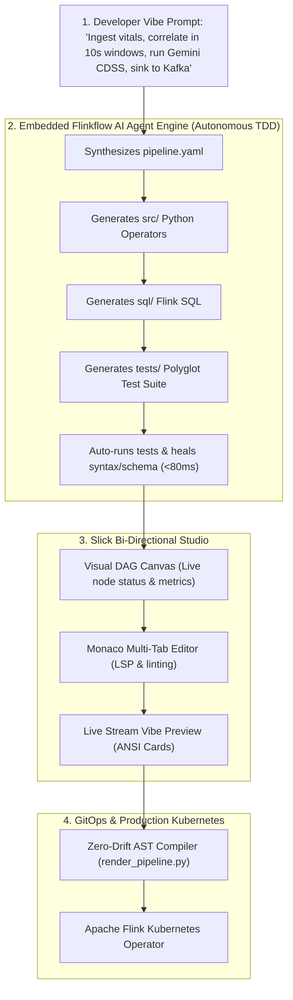

# 🏗️ Architectural Blueprint: Talweg Flinkflow AI Studio
## The Lovable, Slick & Frictionless Streaming Developer Experience (DevEx)

> **STATUS: STANDBY — READY FOR BUILD EXECUTION**  
> **Target Framework**: React / Vite / TypeScript + Monaco Editor + ReactFlow + FastAPI / Python Compiler Backend  
> **Runtime Target**: Apache Flink Kubernetes Operator + Talweg Flinkflow Engine (`ghcr.io/talwegai/flinkflow:latest`)

---

## 1. Product Vision & UX Philosophy

Make real-time stream processing with Apache Flink as intuitive, lovable, and addictive as frontend development. The Studio provides a **slick, modern, zero-intimidation environment** where developers spend more time joyfully building streaming pipelines through **AI "Vibe Coding"**, instant visual feedback, and zero cognitive overload.

```text
┌─────────────────────────────────────────────────────────────────────────────────────────────┐
│                            THE 5 PRODUCT PILLARS OF FLINKFLOW STUDIO                        │
├─────────────────────────────────────────────────────────────────────────────────────────────┤
│ 1. 🧘 ZERO-INTIMIDATION MINIMALISM                                                          │
│    • No cluttered enterprise bloat or 50 confusing configuration menus.                     │
│    • Complex Flink mechanics (watermark delays, checkpoint alignment, JVM parameters)       │
│      are managed automatically with smart, opinionated AI defaults.                         │
│                                                                                             │
│ 2. ⚡ INSTANT GRATIFICATION & SUB-SECOND FEEDBACK                                           │
│    • Sub-50ms unit tests and live dataflow animation directly on the canvas.                │
│    • Real-time ANSI cards previewing live events as you type—no waiting for slow clusters.  │
│                                                                                             │
│ 3. 🎨 SLICK & PREMIUM AESTHETIC                                                             │
│    • Dark-mode glassmorphism, fluid micro-animations, and modern typography                 │
│      (Outfit, JetBrains Mono, Inter).                                                       │
│    • Color-coded streaming node taxonomy with live glowing particle throughput animations.  │
│                                                                                             │
│ 4. 🤖 AI-FIRST "VIBE CODING" (STAY IN THE FLOW STATE)                                       │
│    • Conversational intent: Describe your pipeline, and the AI synthesizes the DAG,        │
│      generates clean Python/SQL code, writes the unit tests, and self-heals any bugs.       │
│                                                                                             │
│ 5. 🎯 THE 3-BUTTON COMMAND BAR (UNCOMPLICATED PRODUCTIVITY)                                 │
│    • Only 3 primary actions on the header:                                                  │
│      [ 🧪 Run Tests (30ms) ]   [ ⚡ Vibe Preview (MiniCluster) ]   [ 🚀 1-Click Deploy ]    │
└─────────────────────────────────────────────────────────────────────────────────────────────┘
```

---

## 2. Interactive Studio Layout (Clean 3-Pane Split)

```text
┌────────────────────────────────────────────────────────────────────────────────────────────────────────────────────────┐
│  Talweg Flinkflow Studio   │  📁 Project: [ ICU-CDSS-Cohort ▼ ]   │  🌐 Env: [ 🟢 Staging K8s ▼ ]  │  [⚙️ Settings]    │
├────────────────────────────┼──────────────────────────────────────┼────────────────────────────────────────────────────┤
│  🤖 AI VIBE COPILOT        │   🎨 VISUAL STREAM CANVAS (ReactFlow)│         💻 MONACO CODE & DATA WORKSPACE            │
│                            │                                      │                                                    │
│  [Prompt Box]:             │       ┌────────────────────────┐     │  [ aidatagen.py ] [ window.sql ] [ ai_agent.py ]   │
│  "Ingest bedside vitals,   │       │ 📡 Source A (Bedside)  │     │ ────────────────────────────────────────────────── │
│   run Gemini sepsis triage │       └───────────┬────────────┘     │  1  def evaluate_patient_window(raw):              │
│   when lactate > 2.0, and  │                   │ (8 msgs/sec)     │  2      # Typed, linted, syntax-highlighted        │
│   sink alerts to Kafka"    │                   ▼                  │  3      if lactate > 2.0 and bp < 90:              │
│                            │       ┌────────────────────────┐     │  4          return query_gemini(raw)               │
│  [AI Response]:            │       │ 🔄 OMOP Harmonizer     │     │                                                    │
│  "Generated pipeline.yaml, │       └───────────┬────────────┘     ├────────────────────────────────────────────────────┤
│   windowed_state.sql, and  │                   │                  │            📺 LIVE STREAM VIBE PREVIEW             │
│   ai_cdss_agent.py. All    │                   ▼                  │  ┏━━━━━━━━━━━━━━━━━━━━━━━━━━━━━━━━━━━━━━━━━━━━━━┓  │
│   21 tests passed (79ms)!" │       ┌────────────────────────┐     │  ┃ 🏥 OMOP AI CDSS ALERT: PATIENT-101 (CRITICAL)┃  │
│                            │       │ 🧠 Gemini AI CDSS      │     │  ┃ ► Acuity: Septic Shock (Lactate: 4.5 mmol/L) ┃  │
│  [✨ Refactor] [💬 Chat]    │       └───────────┬────────────┘     │  ┗━━━━━━━━━━━━━━━━━━━━━━━━━━━━━━━━━━━━━━━━━━━━━━┛  │
│                            │                   │                  │  Events Processed: 1,420 | Latency: 12ms | No Drop │
│                            │                   ▼                  │                                                    │
│                            │       ┌────────────────────────┐     │                                                    │
│                            │       │ 📥 Kafka Alerts Sink   │     │                                                    │
│                            │       └────────────────────────┘     │                                                    │
├────────────────────────────┴──────────────────────────────────────┴────────────────────────────────────────────────────┤
│  [ 🧪 1-Click Test (21/21 PASS: 79ms) ]    [ ⚡ Live MiniCluster Preview ]    [ 🚀 1-Click Deploy to K8s Operator ]     │
└────────────────────────────────────────────────────────────────────────────────────────────────────────────────────────┘
```

---

## 3. End-to-End Visual Workflow



---

## 4. Workspace Scope Hierarchy: Project vs. Pipeline vs. Job

```text
┌─────────────────────────────────────────────────────────────────────────────────────────────┐
│                          FLINKFLOW WORKSPACE SCOPE HIERARCHY                                │
├─────────────────────────────────────────────────────────────────────────────────────────────┤
│ 🏢 1. PROJECT (Workspace Root: flinkflow.project.yaml)                                      │
│    • Contains shared libraries: src/ (Python/Java), sql/ (Flink SQL), schemas/ (Avro/JSON)  │
│    • Manages global environment profiles (Local Dev, Staging K8s, Prod K8s)                 │
│    • Runs project-wide test suites and schema compatibility validations                     │
│         │                                                                                   │
│         ▼                                                                                   │
│ 📐 2. PIPELINE (Declarative DAG: pipeline.yaml)                                             │
│    • Declarative topology connecting sources, Python/SQL operators, and sinks               │
│    • References modular components via 'file: src/...' and 'file: sql/...'                  │
│    • Environment-agnostic (${KAFKA_BOOTSTRAP_SERVERS}, ${GEMINI_API_KEY})                  │
│         │                                                                                   │
│         ▼ (Compiled by render_pipeline.py & submitted to Operator)                          │
│ ⚙️ 3. JOB (Physical Flink Runtime Execution: FlinkDeployment / JobID)                      │
│    • Physical execution graph on JobManager / TaskManagers                                  │
│    • Active RocksDB state checkpointing, savepoint recovery, and task slot distribution     │
└─────────────────────────────────────────────────────────────────────────────────────────────┘
```

### Global Environment Profile Management (`flinkflow.project.yaml`)
```yaml
# flinkflow.project.yaml
name: clinical-streaming-cdss
version: 1.0.0

global:
  default_llm_provider: "gemini"
  default_llm_model: "gemini-2.0-flash"
  state_backend: "rocksdb"

profiles:
  local:
    description: "Local MiniCluster & Docker Kafka"
    KAFKA_BOOTSTRAP_SERVERS: "localhost:9092"
    SCHEMA_REGISTRY_URL: "http://localhost:8081"
    VOCAB_SERVICE_URL: "http://localhost:8082"
    CHECKPOINTS_DIR: "file:///tmp/flink-checkpoints"

  staging:
    description: "Staging Kubernetes Cluster (k3d / EKS Staging)"
    KAFKA_BOOTSTRAP_SERVERS: "kafka-staging.internal:9092"
    SCHEMA_REGISTRY_URL: "http://schema-registry.staging.svc:8081"
    VOCAB_SERVICE_URL: "http://vocab-service.staging.svc:8082"
    CHECKPOINTS_DIR: "s3://staging-flink-state/checkpoints"

  production:
    description: "Production Hospital Kubernetes Cluster"
    KAFKA_BOOTSTRAP_SERVERS: "kafka-cluster-kafka-bootstrap.kafka.svc:9092"
    SCHEMA_REGISTRY_URL: "http://schema-registry.kafka.svc:8081"
    VOCAB_SERVICE_URL: "http://vocab-service.flink-production.svc:8082"
    CHECKPOINTS_DIR: "s3://prod-hospital-flink-state/checkpoints"
```

---

## 5. Polyglot Unit Testing Architecture (Python, Flink SQL & Java)

The AI Agentic IDE operates on an autonomous **Test-Driven Development (TDD)** loop. When the AI synthesizes or modifies any streaming component, it generates the corresponding unit test suite and runs it in the background:

```text
┌─────────────────────────────────────────────────────────────────────────────────────────────┐
│                            TRI-LANGUAGE UNIT TESTING FRAMEWORK                              │
├──────────────────────────────┬──────────────────────────────┬───────────────────────────────┤
│    PYTHON STREAM OPERATORS   │      FLINK SQL WINDOWS       │     JAVA STREAM OPERATORS     │
│       (pytest / unittest)    │     (In-Memory SQL Engines)  │        (JUnit 5 / TestHarness)│
├──────────────────────────────┼──────────────────────────────┼───────────────────────────────┤
│ • Tests data generators &    │ • Tests 10s Tumbling windows │ • Tests custom POJO ser/de &  │
│   synthetic persona buffers  │   & multi-source aggregations│   Java Map/Filter functions   │
│ • Tests dynamic HTTP vocab   │ • Validates OMOP Concept ID  │ • Uses Flink TestHarness for  │
│   lookups & fallbacks        │   conditional CASE WHEN logic│   keyed state & event timers  │
│ • Tests LLM prompts, anomaly │ • Validates column lineage,  │ • Runs in < 150ms via Maven / │
│   gating & fallback rules    │   watermarks & projections   │   Gradle in-memory runner     │
│ • Runs in < 30ms in memory   │ • Runs in < 50ms in SQLite   │                               │
└──────────────────────────────┴──────────────────────────────┴───────────────────────────────┘
```

---

## 6. Environment Healthchecks & Sandbox Integration Testing

### A. Environment Healthcheck Engine (`scripts/env_healthcheck.py`)
Probes live latency, connectivity, and API keys across the target environment profile:
```bash
mise run env:check
```

### B. End-to-End Sandbox Integration Suite (`tests/test_integration_e2e.py`)
Validates that synthetic event generation $\rightarrow$ OMOP harmonization $\rightarrow$ tumbling window aggregation $\rightarrow$ AI CDSS reasoning produce alerts that strictly satisfy the **Confluent Schema Registry Contract (Schema ID: 3)**:
```bash
mise run test:integration
```

---

## 7. Standard Modular Project Structure

```text
flinkflow-project/
├── flinkflow.project.yaml               # Global project config & environment profiles
├── pipeline.yaml                        # Clean ~60-line Declarative DAG topology
│
├── sql/                                 # Pure Flink SQL files (Full syntax & formatting)
│   └── windowed_patient_state.sql       # 10s Tumbling Window aggregation
│
├── src/                                 # Pure Python & Java Modules
│   ├── aidatagen.py                     # Multi-source LLM/Persona stream generator
│   ├── vocab_mapping.py                 # Dynamic OHDSI OMOP Concept Harmonizer
│   ├── ai_cdss_agent.py                 # Multi-provider LLM (Gemini) CDSS engine
│   ├── console_card.py                  # ANSI Visual Triage Card Formatter
│   └── java/                            # Standalone Java streaming operators (optional)
│       └── CustomTransformer.java
│
└── tests/                               # Comprehensive Unit & Integration Test Suites
    ├── conftest.py                      # Test fixtures & mocks
    ├── test_aidatagen.py                # Schema & distribution tests (Python)
    ├── test_vocab_mapping.py            # Concept mapping tests (Python)
    ├── test_ai_cdss_agent.py            # Anomaly gating & fallback tests (Python)
    ├── test_console_card.py             # Card rendering tests (Python)
    ├── test_sql_windowing.py            # SQL windowing & metric aggregations (SQL)
    ├── test_render_pipeline.py          # Compiler & AST verification tests
    └── test_integration_e2e.py         # End-to-end sandbox & schema validation tests

scripts/
├── env_healthcheck.py                   # Real-time infrastructure & AI diagnostic engine
├── render_pipeline.py                   # AST-based inlining compiler & env injector
├── deploy_k8s.sh                        # K8s ConfigMap & FlinkDeployment submitter
└── k8s_setup_wsl.sh                     # Cluster & Flink Operator bootstrapper

k8s/production/                          # Production Kubernetes Manifests (Official Standard)
├── namespace.yaml                       # Namespace: flink-production
├── secrets.yaml                         # Injected secrets template
└── flink-deployment.yaml                # FlinkDeployment Custom Resource (Flink Operator)
```

---

## 8. Build Implementation Checklist for Antigravity Agent

When instructed to build the Studio, the agent should follow this sequence:

- [ ] **Phase 1: Studio Frontend Scaffold** (`Vite + React + TypeScript + TailwindCSS / Custom CSS`)
  - Set up Monaco Editor with Python LSP & Flink SQL syntax highlighter.
  - Set up ReactFlow DAG canvas with custom streaming nodes (Source, Process, SQL, Agent, Sink).
- [ ] **Phase 2: Backend Compiler & Execution Bridge** (`FastAPI`)
  - Connect `scripts/render_pipeline.py` to API endpoint (`POST /api/pipeline/compile`).
  - Connect `scripts/env_healthcheck.py` to API endpoint (`GET /api/env/health`).
  - Connect test runners to API endpoint (`POST /api/tests/run`).
- [ ] **Phase 3: AI Vibe Copilot Integration**
  - Prompt engineer the AI Agent with the Flinkflow DSL & OMOP knowledge base.
  - Implement bidirectional JSON patch sync between AI chat, Monaco editor, and ReactFlow DAG.
- [ ] **Phase 4: Live Vibe Preview & K8s Promotion**
  - Implement WebSocket live stream consumer for MiniCluster ANSI card rendering.
  - Implement 1-click deployment trigger to K8s Operator.
