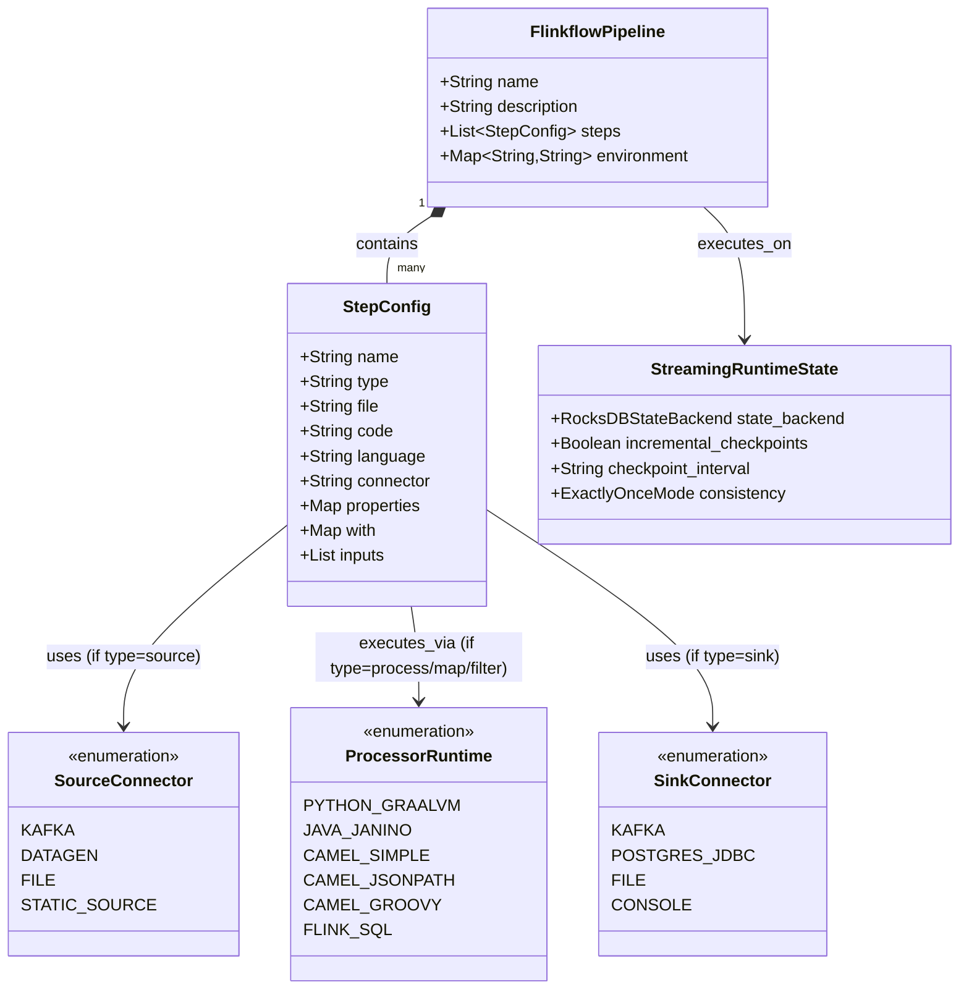

# 🏗️ Architectural Blueprint: Talweg Flinkflow AI Studio
## The Lovable, Slick & Frictionless Streaming Developer Experience (DevEx)

> **STATUS: UPDATED SPEC — 100% SELF-CONTAINED MASTER BLUEPRINT**  
> **Target Framework**: React / Vite / TypeScript + Monaco Editor + ReactFlow + FastAPI / Python Compiler Backend  
> **Runtime Target**: Local Docker / MiniCluster + Apache Flink Kubernetes Operator (`ghcr.io/talwegai/flinkflow:latest`)  
> **Workspace Scope**: Multi-Project Groups (e.g. ICU-CDSS, Fraud-Detection) with Multiple Streaming Jobs under each Project  
> **AI Copilot Intelligence**: 3-Layer Hybrid Knowledge Architecture (Configurable Skills + Flinkflow Core Ontology Graph + Few-Shot Corpus)  
> **Environments**: Multi-Profile (Local Docker | Staging K8s | Production K8s)  
> **LLM Engine**: Cloud API-Based Enterprise LLMs (Google Gemini 2.0 Flash / OpenAI)

---

## 1. Product Vision & UX Philosophy

Make real-time stream processing with Apache Flink as intuitive, lovable, and addictive as frontend development. The Studio provides a **slick, modern, zero-intimidation environment** where developers spend more time joyfully building streaming pipelines through **AI "Vibe Coding"**, instant visual feedback, and zero cognitive overload.

```text
┌─────────────────────────────────────────────────────────────────────────────────────────────┐
│                            THE 5 PRODUCT PILLARS OF FLINKFLOW STUDIO                        │
├─────────────────────────────────────────────────────────────────────────────────────────────┤
│ 1. 🧘 ZERO-INTIMIDATION MINIMALISM                                                          │
│    • No cluttered enterprise bloat or 50 confusing configuration menus.                     │
│    • Complex Flink mechanics (watermark delays, checkpoint alignment, JVM parameters)       │
│      are managed automatically with smart, opinionated AI defaults.                         │
│                                                                                             │
│ 2. ⚡ INSTANT GRATIFICATION & SUB-SECOND FEEDBACK                                           │
│    • Sub-50ms unit tests and live dataflow animation directly on the canvas.                │
│    • Real-time ANSI cards previewing live events as you type—no waiting for slow clusters.  │
│                                                                                             │
│ 3. 🎨 SLICK & PREMIUM AESTHETIC                                                             │
│    • Dark-mode glassmorphism, fluid micro-animations, and modern typography                 │
│      (Outfit, JetBrains Mono, Inter).                                                       │
│    • Color-coded streaming node taxonomy with live glowing particle throughput animations.  │
│                                                                                             │
│ 4. 🧠 3-LAYER HYBRID AI COPILOT (ZERO-HALLUCINATION STREAMING AGENT)                        │
│    • Grounded in the formal Flinkflow Core Ontology & Knowledge Graph (from Java engine).   │
│    • Governed by configurable Agent Skills (`.agents/skills/flinkflow-dsl/SKILL.md`).       │
│    • Guided by dynamic Few-Shot In-Context Learning (`reference-corpus/`).                  │
│                                                                                             │
│ 5. 🎯 THE 3-BUTTON COMMAND BAR (UNCOMPLICATED PRODUCTIVITY)                                 │
│    • Only 3 primary actions on the header:                                                  │
│      [ 🧪 Run Tests (30ms) ]   [ ⚡ Vibe Preview (Local/Docker) ]   [ 🚀 Deploy via CI/CD ] │
└─────────────────────────────────────────────────────────────────────────────────────────────┘
```

---

## 2. The 3-Layer Hybrid Knowledge Architecture for AI Studio

To guarantee that the AI Studio Copilot produces deterministic, syntax-perfect, and runtime-valid streaming topologies without hallucination, the Studio implements a **3-Layer Hybrid Knowledge Architecture**:

```text
┌─────────────────────────────────────────────────────────────────────────────────────────────┐
│                       3-LAYER HYBRID AI COPILOT KNOWLEDGE ARCHITECTURE                      │
├─────────────────────────────────────────────────────────────────────────────────────────────┤
│                                                                                             │
│  🔺 LAYER 1: CONFIGURABLE AGENT SKILLS & RULES (`.agents/skills/flinkflow-dsl/SKILL.md`)   │
│     • Deterministic YAML grammar, AST compiler rules, and TDD unit test synthesis patterns. │
│     • 100% configurable by DevOps/Engineers without retraining or fine-tuning models.       │
│                                                                                             │
│  🔷 LAYER 2: FLINKFLOW CORE ONTOLOGY & KNOWLEDGE GRAPH (`config/ontology.json`)             │
│     • Formal semantic schema extracted directly from `ai.talweg.flinkflow` Java core.       │
│     • Entities: Step, Source, Process, Sql, Filter, Join, Flowlet, Sink, Runtime, State.    │
│     • Relationship Triples: Enforces type compatibility, Kafka properties & RocksDB backend.│
│                                                                                             │
│  🟩 LAYER 3: DYNAMIC FEW-SHOT REFERENCE CORPUS (`reference-corpus/` or `flinkflow-jobs/`)   │
│     • Real-world polyglot reference examples (Java Janino, Python GraalVM, Flink SQL, OMOP)│
│     • Retrieved dynamically via cosine similarity on the developer's prompt.                │
└─────────────────────────────────────────────────────────────────────────────────────────────┘
```

---

## 3. Flinkflow Core Knowledge Graph (Discovered from Java Engine)

The Knowledge Graph models the exact classes, execution factories, and connectors of the Flinkflow Java engine (`ai.talweg.flinkflow`):



### Knowledge Graph Semantic Triples (In-Context Truth)
* `(SourceStep:Production)`: Ingests real-world streams from **CDC (Debezium Postgres/MySQL/Outbox), Kafka, Microservice Event Buses, HTTP Webhooks, or Cloud Queues (Kinesis/Pulsar)**.
* `(SourceStep:Sandbox)`: Uses **`datagen` or synthetic Python generators (`aidatagen.py`)** purely as in-IDE sandbox simulators for live visual preview & unit testing before connecting live infrastructure.
* `(SinkStep:Production)`: Emits to **Kafka, PostgreSQL, ClickHouse, Apache Iceberg, Snowflake, Elasticsearch, or downstream Microservices**.
* `(SinkStep:Sandbox)`: Uses **`console` or ANSI visualizers (`console_card.py`)** purely to render live triage cards in the IDE stream preview tab.
* `(ProcessStep:Python) -[EXECUTED_BY]-> (DynamicPythonMapFunction / GraalVM)`
* `(ProcessStep:Java) -[COMPILED_BY]-> (Janino DynamicCodeFunction)`
* `(SqlStep:FlinkSQL) -[REQUIRES_INPUTS]-> (SingleStream | TwoStreamIntervalJoin)`
* `(SqlStep:TumblingWindow) -[REQUIRES_EVENT_TIME]-> (WATERMARK FOR event_time AS ...)`
* `(Pipeline) -[COMPILED_BY]-> (render_pipeline.py Zero-Drift AST Inliner)`
* `(Pipeline) -[DEPLOYED_TO]-> (Apache Flink Kubernetes Operator CRD)`

---

## 4. Universal Source & Sink Taxonomy (Production vs. In-IDE Sandbox)

The AI Studio Copilot treats Sources and Sinks with an enterprise **Dual-Mode Taxonomy**:

```text
┌────────────────────────────────────────────────────────────────────────────────────────────────────────┐
│                          UNIVERSAL SOURCE & SINK DUAL-MODE TAXONOMY                                    │
├────────────────────────────────────────────────────────────────────────────────────────────────────────┤
│ 🌐 1. PRODUCTION MODE (Real-World Enterprise Streaming)                                                │
│    • Sources: Change Data Capture (CDC / Debezium), Kafka Event Hubs, Microservices, Webhooks, S3/GCS  │
│    • Sinks: Kafka Downstream Topics, PostgreSQL / JDBC, Snowflake, ClickHouse, Apache Iceberg, REST     │
│                                                                                                        │
│ 🧪 2. IN-IDE SANDBOX MODE (Sub-Second Visual Feedback & Testing)                                       │
│    • Sources: Synthetic Python Generators (`aidatagen.py`) or Flink `datagen` connector                │
│    • Sinks: ANSI Visual Card Renderers (`console_card.py`) or Stream Preview WebSocket                 │
│    • Purpose: Allows developers to test end-to-end DAG logic immediately without waiting for real data.│
└────────────────────────────────────────────────────────────────────────────────────────────────────────┘
```

---

## 4. Interactive Studio Layout (Clean 3-Pane Split with Project Drawer)

```text
┌─────────────────────────────────────────────────────────────────────────────────────────────────────────────────────────────────┐
│  Talweg Flinkflow Studio   │  📁 Project Group: [ 🏥 ICU-Clinical-CDSS ▼ ]   │  🌐 Env: [ 🟢 Staging K8s ▼ ]  │  [⚙️ Settings]   │
├────────────────────────────┬──────────────────────────────────────┬─────────────────────────────────────────────────────────────┤
│  📁 PROJECT JOBS & COPILOT │   🎨 VISUAL STREAM CANVAS (ReactFlow)│         💻 MONACO CODE & DATA WORKSPACE                     │
│                            │                                      │                                                             │
│  [ ACTIVE PROJECT GROUP ]: │       ┌────────────────────────┐     │  [ aidatagen.py ] [ window.sql ] [ ai_agent.py ]            │
│  • omop-ai-cdss-agent (●)  │       │ 📡 Source A (Bedside)  │     │ ─────────────────────────────────────────────────────────── │
│  • sepsis-early-warning    │       └───────────┬────────────┘     │  1  def evaluate_patient_window(raw):                       │
│  • bedside-vitals-ingest   │                   │ (8 msgs/sec)     │  2      # Typed, linted, syntax-highlighted                 │
│  [ ➕ New Job under Group ]│                   ▼                  │  3      if lactate > 2.0 and bp < 90:                       │
│  ───────────────────────── │       ┌────────────────────────┐     │  4          return query_gemini(raw)                        │
│  🤖 AI VIBE COPILOT:       │       │ 🔄 OMOP Harmonizer     │     │                                                             │
│  [Prompt Box]:             │       └───────────┬────────────┘     ├─────────────────────────────────────────────────────────────┤
│  "Add sepsis alert job     │                   │                  │            📺 LIVE STREAM VIBE PREVIEW                      │
│   under ICU project with   │                   ▼                  │  ┏━━━━━━━━━━━━━━━━━━━━━━━━━━━━━━━━━━━━━━━━━━━━━━┓           │
│   10s tumbling windows"    │       ┌────────────────────────┐     │  ┃ 🏥 OMOP AI CDSS ALERT: PATIENT-101 (CRITICAL)┃           │
│                            │       │ 🧠 Gemini AI CDSS      │     │  ┃ ► Acuity: Septic Shock (Lactate: 4.5 mmol/L) ┃           │
│  [AI Response]:            │       └───────────┬────────────┘     │  ┗━━━━━━━━━━━━━━━━━━━━━━━━━━━━━━━━━━━━━━━━━━━━━━┛           │
│  "Created new job pipeline │                   │                  │  Events Processed: 1,420 | Latency: 12ms | No Drop          │
│   in ICU project group.    │                   ▼                  │                                                             │
│   All 21 tests passed!"    │       ┌────────────────────────┐     │                                                             │
│  [✨ Refactor] [💬 Chat]    │       │ 📥 Kafka Alerts Sink   │     │                                                             │
│                            │       └────────────────────────┘     │                                                             │
├────────────────────────────┴──────────────────────────────────────┴─────────────────────────────────────────────────────────────┤
│  [ 🧪 1-Click Test (21/21 PASS: 79ms) ]    [ ⚡ Live MiniCluster Preview ]    [ 🚀 1-Click Deploy via Enterprise CI/CD ]         │
└─────────────────────────────────────────────────────────────────────────────────────────────────────────────────────────────────┘
```

---

## 5. Project Group vs. Job Workspace Scope Hierarchy

```text
┌─────────────────────────────────────────────────────────────────────────────────────────────┐
│                          FLINKFLOW PROJECT-BASED WORKSPACE HIERARCHY                        │
├─────────────────────────────────────────────────────────────────────────────────────────────┤
│ 🏢 1. PROJECT GROUP (e.g. "icu-clinical-cdss" / "financial-fraud")                          │
│    • Defined by `project.yaml` metadata (domain, shared libraries, environment overrides)   │
│    • Houses shared Python modules (`src/`), Flink SQL (`sql/`), schemas (`schemas/`)        │
│         │                                                                                   │
│         ├───► 📐 JOB 1: `jobs/omop-ai-cdss-agent.yaml` (Real-time sepsis triage)            │
│         ├───► 📐 JOB 2: `jobs/bedside-vitals-ingest.yaml` (High-throughput sensor parser)   │
│         └───► 📐 JOB 3: `jobs/lab-alerts-enrichment.yaml` (EHR lab result joiner)           │
│                   │                                                                         │
│                   ▼ (Compiled by render_pipeline.py & submitted to Target Runtime)          │
│ ⚙️ 2. PHYSICAL RUNTIME EXECUTION (Local Docker JobManager / Kubernetes Operator CRD)        │
│    • Independent RocksDB state checkpoints, task slots, and scaling metrics per job        │
└─────────────────────────────────────────────────────────────────────────────────────────────┘
```

---

## 6. Standard Infrastructure Ports

| Service | Standard Port (Cluster / Production) | Local Host Mapping | Reason / Standard |
| :--- | :--- | :--- | :--- |
| **Apache Kafka** | `9092` (Plaintext / Bootstrap) | `localhost:9092` | Official Apache Kafka Port |
| **Kafka (Internal Docker)**| `29092` | `kafka:29092` | Inter-broker / internal container network |
| **Apache Flink Web / REST**| `8081` | `localhost:8081` | Official Apache Flink REST API |
| **Schema Registry** | `8081` (Cluster default) | `localhost:8084` | Mapped to `8084` locally to avoid collision with Flink |
| **PostgreSQL** | `5432` | `localhost:5432` | Standard PostgreSQL JDBC Port |
| **OMOP Vocab Service** | `8082` | `localhost:8082` | Microservice REST API Port |
| **Langfuse LLM Observability**| `4000` (Web UI) / `8123` (ClickHouse)| `localhost:4000` | Standard Langfuse UI Port |

---

## 7. Multi-Environment Architecture: Local vs. Stage & Prod

```text
┌────────────────────────────────────────────────────────────────────────────────────────────────────────┐
│                        FLINKFLOW STUDIO ENVIRONMENT RESOLUTION PIPELINE                                │
├────────────────────────────────────────────────────────────────────────────────────────────────────────┤
│                                                                                                        │
│  [ 🌐 Environment Selector in UI ]                                                                     │
│         │                                                                                              │
│         ├───► [ 🐳 Local Docker / MiniCluster ]                                                        │
│         │       • Cloud API LLM (Gemini 2.0 Flash) synthesizes and validates pipeline DAG              │
│         │       • Live DAG preview via Local Docker Flink REST API (http://127.0.0.1:8081)             │
│         │       • Zero Kubernetes dependencies on developer workstation                                │
│         │                                                                                              │
│         └───► [ 🟢 Staging K8s ] or [ 🔴 Production K8s ]                                              │
│                 • Clicking [ 🚀 1-Click Deploy ] dispatches to GitHub Actions / Enterprise CI API      │
│                 • Cloud runner compiles pipeline AST, validates schemas & deploys to K8s               │
│                 • Staging smoke test -> Protected promotion gate -> Production deployment              │
│                 • Zero local kubectl or cloud credential dependencies on developer machine             │
└────────────────────────────────────────────────────────────────────────────────────────────────────────┘
```

---

## 8. Standard Workspace Structure: Dynamic Projects vs. Few-Shot Knowledge Corpus

```text
flinkflow-workspace/
├── config/
│   ├── environments.yaml                 # Global environment profiles (Local, Staging, Prod)
│   └── ontology.json                     # Ground-truth Flinkflow Core Knowledge Graph schema
│
├── .agents/
│   └── skills/
│       └── flinkflow-dsl/
│           └── SKILL.md                  # Configurable Agent Skill & Prompt Instructions
│
├── projects/                             # 🚀 DYNAMIC USER PROJECTS (Active Workspaces)
│   │
│   ├── icu-clinical-cdss/                # Dynamic Project Group: Healthcare CDSS
│   │   ├── project.yaml                  # Project Group metadata, jobs list & shared config
│   │   ├── jobs/                         # Streaming Job YAMLs under this Project Group
│   │   │   ├── omop-ai-cdss-agent.yaml   # User Job 1: AI Triage Agent
│   │   │   └── bedside-vitals-ingest.yaml# User Job 2: Sensor Ingest
│   │   ├── sql/                          # Shared SQL files for this project
│   │   │   └── windowed_patient_state.sql
│   │   ├── src/                          # Shared Python & Java modules for this project
│   │   │   ├── aidatagen.py
│   │   │   ├── vocab_mapping.py
│   │   │   ├── ai_cdss_agent.py
│   │   │   └── console_card.py
│   │   └── tests/                        # Sub-50ms unit test suite for this project
│   │       └── test_omop_pipeline.py
│   │
│   └── financial-fraud/                  # Dynamic Project Group: Financial Fraud
│       ├── project.yaml
│       ├── jobs/
│       │   └── card-interval-join.yaml
│       ├── sql/
│       ├── src/
│       └── tests/
│
├── reference-corpus/ (or flinkflow-jobs/)# 📚 FEW-SHOT AI KNOWLEDGE CORPUS (Zero Hardcoded Runtime Jobs)
│   │                                     # Used purely by AI Vibe Copilot for prompt in-context learning
│   ├── java/                             # Reference few-shot example: Pure Java Map/Filter
│   ├── python/                           # Reference few-shot example: Python Pandas/Datetime
│   ├── sql/                              # Reference few-shot example: Flink SQL Interval Joins
│   └── hybrid/                           # Reference few-shot example: Multi-language OMOP CDSS
│
├── scripts/
│   ├── env_manager.py                   # Profile reader/writer & Studio API backend
│   ├── render_pipeline.py               # AST-based inlining compiler & env injector
│   └── deploy_k8s.sh                    # Dynamic Kubernetes Operator submitter (Zero hardcoded defaults)
│
├── k8s/
│   └── flink-deployment.template.yaml   # Generic FlinkDeployment CRD template
│
└── .github/workflows/
    └── ci.yml                           # 4-stage automated matrix CI/CD workflow (Path-agnostic)
```

---

## 9. Continuous Engine Evolution & Knowledge Sync Loop

When you enhance the Flinkflow Java engine (e.g. adding new Step types, new Connectors, Iceberg sinks, or new language runtimes), the IDE and Copilot stay synchronized without manual rewriting:

```text
┌─────────────────────────────────────────────────────────────────────────────────────────────┐
│                   CONTINUOUS FLINKFLOW ENGINE EVOLUTION & SYNC WORKFLOW                     │
├─────────────────────────────────────────────────────────────────────────────────────────────┤
│ 1. ⚙️ Java Engine Enhancement (`ai.talweg.flinkflow`)                                       │
│    • Developer adds a new connector or step type in `StepConfig.java` / `ProcessorFactory`  │
│                                                                                             │
│ 2. 🔄 Automated Ontology Extraction (`mise run ontology:sync`)                              │
│    • `scripts/extract_ontology.py` scans Java AST and regenerates `config/ontology.json`     │
│    • Updates valid YAML types, language enums, and connector property constraints           │
│                                                                                             │
│ 3. 🧠 Instant Studio IDE & Copilot Ingestion (Zero-Rebuild)                                 │
│    • Studio backend hot-reloads `config/ontology.json`                                      │
│    • Monaco Editor LSP automatically autocompletes the new step types and properties        │
│    • ReactFlow Canvas adds the new node type to the visual drag-and-drop palette            │
│    • AI Copilot immediately starts generating pipelines using the new engine features       │
└─────────────────────────────────────────────────────────────────────────────────────────────┘
```

---

## 10. Build Implementation Checklist for Antigravity Agent

When constructing the Studio, execute the following sequence:

- [ ] **Phase 1: Project Groups & Ultra-Fluid Studio Frontend** (`React + Vite + TypeScript + Glassmorphism CSS`)
  - Project Group Selector dropdown & Project Explorer drawer (`projects/` tree).
  - Ability to create new Project Groups (`[ 📁 New Project ]`) and create new Jobs under any Project (`[ ➕ New Job ]`).
  - Monaco Editor with dark-mode syntax highlighters (Python, SQL, YAML).
  - ReactFlow DAG canvas with custom nodes (Source, Process, SQL, Agent, Sink) and animated particle throughput.
  - Environment Selector dropdown (`🐳 Local Docker` | `🟢 Staging K8s` | `🔴 Production K8s`).
  - Settings Modal with live connectivity test probes and standard port defaults.
- [ ] **Phase 2: 3-Layer Hybrid AI Copilot Engine**
  - Ingest `config/ontology.json` and `.agents/skills/flinkflow-dsl/SKILL.md` into Copilot prompt system context.
  - Implement dynamic cosine similarity retriever over `reference-corpus/` for prompt few-shot injection.
  - Google Gemini 2.0 Flash / OpenAI API adapter for real-time code and DAG synthesis scoped to active Project Group.
  - Bidirectional JSON patch synchronization between AI Chat, Monaco Editor, and Visual DAG.
- [ ] **Phase 3: Fast Local Preview Engine**
  - Connect `scripts/render_pipeline.py` for instant AST compilation of any job under the active project.
  - Live ANSI Card visualizer for real-time streaming preview against local Docker cluster.
- [ ] **Phase 4: Enterprise CI/CD Deployment Bridge**
  - Implement GitHub Actions / GitLab CI dispatch API integration for Staging and Production promotions.
  - Display live CI/CD pipeline progress and deployment status per project job in the Studio UI.

---

## 11. Phased Prompting Playbook (Token-Efficient Execution for Antigravity)

To build the Studio with maximum token efficiency and zero context blowup, use the following **4 sequential prompts**:

### 🎯 Turn 1: Scaffold Frontend & 3-Pane Layout (Phase 1)
```markdown
Read Section 1, 4, and Phase 1 in `BLUEPRINT.md`. Scaffold the Talweg Flinkflow Studio frontend.

Requirements:
- Stack: React + Vite + TypeScript + Custom Glassmorphism CSS + JetBrains Mono / Outfit typography.
- UI Layout:
  1. Top Header: Project Group dropdown (`[ 🏥 ICU-Clinical-CDSS ▼ ]`), Environment dropdown (`[ 🐳 Local Docker ▼ ]`), Settings button, and 3-Button Command Bar (`[ 🧪 Run Tests ]`, `[ ⚡ Live Preview ]`, `[ 🚀 1-Click Deploy ]`).
  2. Left Pane: Project Tree (Jobs under active project group) + AI Copilot chat interface.
  3. Center Pane: ReactFlow streaming DAG canvas with color-coded nodes and animated particle flow.
  4. Right Pane: Monaco Multi-Tab Editor + ANSI Card Stream Preview visualizer.
- Deliver a working, responsive frontend running on `http://localhost:5173`.
```

### 🎯 Turn 2: AI Copilot & 3-Layer Knowledge Architecture (Phase 2)
```markdown
Read Section 2, 3, and Phase 2 in `BLUEPRINT.md`. Implement the 3-Layer Hybrid AI Copilot engine in the Studio.

Requirements:
- Read `config/ontology.json` and `.agents/skills/flinkflow-dsl/SKILL.md` to ground the LLM in valid Flinkflow step types.
- Wire Google Gemini 2.0 Flash / OpenAI API to the Copilot chat drawer.
- When the user prompts ("Generate sepsis alert job with 10s windows under ICU project"), synthesize `jobs/<name>.yaml`, `src/<name>.py`, and `sql/<name>.sql`.
- Enable bidirectional sync: clicking a node in ReactFlow navigates to its code in Monaco; editing code in Monaco updates the DAG node in real time.
```

### 🎯 Turn 3: Fast Local Preview Engine & AST Compiler (Phase 3)
```markdown
Read Section 7, Phase 3, and Appendix 12.E in `BLUEPRINT.md`. Implement the Local Preview Engine.

Requirements:
- Scaffold FastAPI Python backend (`server/main.py`) exposing:
  1. `POST /api/pipeline/compile`: Executes AST inlining compiler (`scripts/render_pipeline.py`).
  2. `POST /api/pipeline/preview`: Runs the pipeline against local Docker Flink cluster (`http://localhost:8081`).
  3. `GET /api/environments`: Reads and updates `config/environments.yaml` via `scripts/env_manager.py`.
- Connect the frontend `[ ⚡ Live Preview ]` button to stream ANSI triage cards in the preview drawer.
```

### 🎯 Turn 4: Enterprise CI/CD Deployment Bridge (Phase 4)
```markdown
Read Section 6, Phase 4, and Appendix 12.G in `BLUEPRINT.md`. Implement the Enterprise CI/CD Deployment Bridge.

Requirements:
- Connect the `[ 🚀 1-Click Deploy ]` button to trigger the GitHub Actions CI workflow dispatch API (`POST /repos/{owner}/{repo}/actions/workflows/ci.yml/dispatches`).
- Pass `pipeline_path` and `target_env` ('staging' or 'production').
- Display a live deployment status drawer in the UI showing CI run progress and Kubernetes pod rollout.
```

---

## 12. Self-Contained Implementation Code Reference (Appendix)

This section embeds the full, working implementation code for all core scripts, configuration files, and reference pipelines so that any agent building the Studio can generate them directly without needing external directory access.

### A. Flinkflow Core Ontology Knowledge Graph (`config/ontology.json`)
```json
{
  "$schema": "https://json-schema.org/draft/2020-12/schema",
  "title": "FlinkflowCoreOntology",
  "version": "1.2.0",
  "discovery_mode": "Zero-Hardcoding Dynamic Java AST Analysis",
  "engine_source_files_scanned": 65,
  "entities": {
    "Step": {
      "types": [
        "agent",
        "aggregate",
        "bigint",
        "bool",
        "boolean",
        "char",
        "console-sink",
        "datagen",
        "datagen-source",
        "datamapper",
        "date",
        "decimal",
        "double",
        "file-sink",
        "file-source",
        "filter",
        "flatmap",
        "float",
        "flowlet",
        "fluss-lookup",
        "fluss-sink",
        "fluss-source",
        "google",
        "groupby",
        "http-lookup",
        "http-sink",
        "int",
        "integer",
        "jdbc-sink",
        "join",
        "kafka-avro-sink",
        "kafka-avro-source",
        "kafka-sink",
        "kafka-source",
        "keyby",
        "long",
        "ml",
        "ollama",
        "openai",
        "process",
        "reduce",
        "s3-sink",
        "s3-source",
        "sideoutput",
        "sink",
        "smallint",
        "source",
        "sql",
        "static-source",
        "string",
        "timestamp",
        "tinyint",
        "transform",
        "varchar",
        "vector",
        "vertex",
        "webhook-sink",
        "window"
      ],
      "properties": {
        "name": {
          "type": "string",
          "required": true
        },
        "type": {
          "type": "string",
          "enum": [
            "agent",
            "aggregate",
            "bigint",
            "bool",
            "boolean",
            "char",
            "console-sink",
            "datagen",
            "datagen-source",
            "datamapper",
            "date",
            "decimal",
            "double",
            "file-sink",
            "file-source",
            "filter",
            "flatmap",
            "float",
            "flowlet",
            "fluss-lookup",
            "fluss-sink",
            "fluss-source",
            "google",
            "groupby",
            "http-lookup",
            "http-sink",
            "int",
            "integer",
            "jdbc-sink",
            "join",
            "kafka-avro-sink",
            "kafka-avro-source",
            "kafka-sink",
            "kafka-source",
            "keyby",
            "long",
            "ml",
            "ollama",
            "openai",
            "process",
            "reduce",
            "s3-sink",
            "s3-source",
            "sideoutput",
            "sink",
            "smallint",
            "source",
            "sql",
            "static-source",
            "string",
            "timestamp",
            "tinyint",
            "transform",
            "varchar",
            "vector",
            "vertex",
            "webhook-sink",
            "window"
          ],
          "required": true
        },
        "file": {
          "type": "string",
          "description": "Relative path to external code or SQL"
        },
        "language": {
          "type": "string",
          "enum": [
            "camel",
            "camel-groovy",
            "camel-jsonpath",
            "camel-simple",
            "camel-yaml",
            "groovy",
            "jsonpath",
            "python"
          ]
        },
        "connector": {
          "type": "string",
          "enum": [
            "console",
            "console-sink",
            "datagen",
            "datagen-source",
            "file",
            "file-sink",
            "file-source",
            "fluss",
            "fluss-sink",
            "fluss-source",
            "http-sink",
            "jdbc-sink",
            "kafka",
            "kafka-avro-sink",
            "kafka-avro-source",
            "kafka-sink",
            "kafka-source",
            "postgres",
            "s3-sink",
            "s3-source",
            "static-source",
            "webhook-sink"
          ]
        },
        "properties": {
          "type": "object"
        },
        "inputs": {
          "type": "array",
          "items": {
            "type": "string"
          }
        },
        "with": {
          "type": "object",
          "description": "Parameters for flowlet expansion"
        }
      }
    },
    "Connectors": {
      "kafka": {
        "required_properties": [
          "properties.bootstrap.servers",
          "topic"
        ],
        "optional_properties": [
          "properties.group.id",
          "scan.startup.mode",
          "topic",
          "value.format"
        ]
      },
      "fluss": {
        "required_properties": [
          "bootstrap.servers",
          "table"
        ],
        "optional_properties": [
          "cacheSize",
          "cacheTtlSec",
          "fluss.client.timeout",
          "fluss.lakehouse.format",
          "key",
          "lookupKey",
          "merge-engine",
          "outputField",
          "table",
          "table.path"
        ]
      },
      "postgres": {
        "required_properties": [
          "password",
          "table-name",
          "url",
          "username"
        ],
        "optional_properties": [
          "batch-size",
          "driver",
          "sql"
        ]
      },
      "datagen": {
        "required_properties": [],
        "optional_properties": [
          "fields",
          "number-of-rows",
          "rows-per-second"
        ]
      },
      "file": {
        "required_properties": [
          "path"
        ],
        "optional_properties": [
          "format",
          "rolling-policy"
        ]
      },
      "console": {
        "required_properties": [],
        "optional_properties": [
          "prefix"
        ]
      },
      "s3": {
        "required_properties": [],
        "optional_properties": []
      },
      "static": {
        "required_properties": [],
        "optional_properties": []
      },
      "kafka-avro": {
        "required_properties": [],
        "optional_properties": []
      },
      "http": {
        "required_properties": [],
        "optional_properties": []
      },
      "webhook": {
        "required_properties": [],
        "optional_properties": []
      },
      "jdbc": {
        "required_properties": [],
        "optional_properties": []
      }
    },
    "RuntimeEngines": {
      "python": {
        "engine": "GraalVM Python",
        "entrypoint_pattern": "def process(input):"
      },
      "java": {
        "engine": "Janino Runtime Compiler",
        "interface": "MapFunction<String, String>"
      },
      "sql": {
        "engine": "Apache Flink StreamTableEnvironment",
        "watermark_required_for_windows": true
      },
      "fluss": {
        "engine": "Apache Fluss Real-Time Lakehouse Storage & Streaming Tier",
        "supports_streaming_read_write": true
      }
    }
  }
}
```

### B. Configurable Agent Skill (`.agents/skills/flinkflow-dsl/SKILL.md`)
```markdown
---
name: flinkflow-dsl
description: Master rules and syntax grammar for synthesizing valid Talweg Flinkflow streaming YAML pipelines.
---

# Flinkflow DSL Copilot Rules

When synthesizing or editing a Flinkflow streaming job:
1. Always output a valid declarative YAML document with `name` and `steps`.
2. Step Types (Universal Dual-Mode Taxonomy):
   - `type: source`:
     • Production Mode: Ingests from real-world enterprise sources (`connector: kafka` with CDC Debezium/Postgres topics, microservice event hubs, or webhooks).
     • In-IDE Sandbox Mode: Uses synthetic Python generators (`file: src/<name>_datagen.py`) or `connector: datagen` for instant live stream preview in the IDE.
   - `type: process`: Store logic in `src/<name>.py` and reference via `file: src/<name>.py`. Ensure `def process(input):` or descriptive entrypoint.
   - `type: sql`: Store Flink SQL transformations in `sql/<name>.sql` and reference via `file: sql/<name>.sql`.
   - `type: sink`:
     • Production Mode: Routes to enterprise downstream sinks (`connector: kafka`, `connector: postgres`, ClickHouse, Iceberg, Snowflake).
     • In-IDE Sandbox Mode: Uses ANSI card formatters (`file: src/<name>_card.py`) or console to render live cards in the IDE preview tab.
3. Modular Separation:
   - NEVER place large multi-line Python scripts directly in YAML. Always use `file: src/...` and `file: sql/...`.
4. Automated TDD:
   - Always synthesize a companion `tests/test_<name>.py` unit test suite executable in <50ms.
```

### C. Environment Profiles (`config/environments.yaml`)
```yaml
version: "1.0"
active_environment: "local"

environments:
  local:
    name: "Local Docker Engine"
    description: "Fast local development on Docker Compose with cloud API LLM"
    type: "docker"
    icon: "🐳"
    endpoints:
      kafka_bootstrap: "localhost:9092"
      schema_registry_url: "http://localhost:8084"
      postgres_url: "jdbc:postgresql://localhost:5432/outbox_demo"
      vocab_service_url: "http://localhost:8082"
      flink_jobmanager_url: "http://localhost:8081"
    topics:
      omop_events_topic: "omop-standard-events"
      omop_ai_alerts_topic: "omop-cdss-ai-alerts"
    llm:
      provider: "gemini"
      model: "gemini-2.0-flash"
      api_key_env: "GEMINI_API_KEY"

  staging:
    name: "Staging Kubernetes"
    description: "Pre-production validation cluster with integration testing"
    type: "kubernetes"
    icon: "🟢"
    cluster:
      namespace: "flink-staging"
    endpoints:
      kafka_bootstrap: "kafka-cluster-kafka-bootstrap.kafka.svc.cluster.local:9092"
      schema_registry_url: "http://schema-registry.kafka.svc.cluster.local:8081"
      postgres_url: "jdbc:postgresql://postgres.flink-staging.svc.cluster.local:5432/outbox_demo"
      vocab_service_url: "http://vocab-service.flink-staging.svc.cluster.local:8082"
    topics:
      omop_events_topic: "staging-omop-standard-events"
      omop_ai_alerts_topic: "staging-omop-cdss-ai-alerts"
    llm:
      provider: "gemini"
      model: "gemini-2.0-flash"
      api_key_secret: "flinkflow-secrets/GEMINI_API_KEY"

  production:
    name: "Production Kubernetes"
    description: "High-Availability Production Cluster with 24/7 SLA & RocksDB HA"
    type: "kubernetes"
    icon: "🔴"
    cluster:
      namespace: "flink-production"
      require_approval_gate: true
    endpoints:
      kafka_bootstrap: "kafka-cluster-kafka-bootstrap.kafka.svc.cluster.local:9092"
      schema_registry_url: "http://schema-registry.kafka.svc.cluster.local:8081"
      postgres_url: "jdbc:postgresql://postgres.flink-production.svc.cluster.local:5432/outbox_demo"
      vocab_service_url: "http://vocab-service.flink-production.svc.cluster.local:8082"
    topics:
      omop_events_topic: "prod-omop-standard-events"
      omop_ai_alerts_topic: "prod-omop-cdss-ai-alerts"
    llm:
      provider: "gemini"
      model: "gemini-2.0-flash"
      api_key_secret: "flinkflow-secrets/GEMINI_API_KEY"
```

### D. Environment Profile Manager (`scripts/env_manager.py`)
```python
#!/usr/bin/env python3
import argparse
import json
import os
import sys
import yaml
from pathlib import Path
from typing import Dict, Any

SCRIPT_DIR = Path(__file__).resolve().parent
ROOT_DIR = SCRIPT_DIR.parent
CONFIG_FILE = ROOT_DIR / "config" / "environments.yaml"

def load_config() -> Dict[str, Any]:
    if not CONFIG_FILE.exists():
        raise FileNotFoundError(f"Environments config not found: {CONFIG_FILE}")
    with open(CONFIG_FILE, "r", encoding="utf-8") as f:
        return yaml.safe_load(f) or {}

def save_config(config: Dict[str, Any]) -> None:
    CONFIG_FILE.parent.mkdir(parents=True, exist_ok=True)
    with open(CONFIG_FILE, "w", encoding="utf-8") as f:
        yaml.dump(config, f, default_flow_style=False, sort_keys=False)

def get_environment_profile(env_name: str) -> Dict[str, Any]:
    config = load_config()
    envs = config.get("environments", {})
    if env_name not in envs:
        raise ValueError(f"Environment '{env_name}' not found. Available: {list(envs.keys())}")
    return envs[env_name]

def export_env_vars(env_name: str) -> Dict[str, str]:
    profile = get_environment_profile(env_name)
    endpoints = profile.get("endpoints", {})
    topics = profile.get("topics", {})
    llm = profile.get("llm", {})
    cluster = profile.get("cluster", {})
    return {
        "FLINKFLOW_ENV": env_name,
        "KAFKA_BOOTSTRAP_SERVERS": endpoints.get("kafka_bootstrap", "localhost:9092"),
        "SCHEMA_REGISTRY_URL": endpoints.get("schema_registry_url", "http://localhost:8084"),
        "POSTGRES_URL": endpoints.get("postgres_url", "jdbc:postgresql://localhost:5432/outbox_demo"),
        "VOCAB_SERVICE_URL": endpoints.get("vocab_service_url", "http://localhost:8082"),
        "OMOP_EVENTS_TOPIC": topics.get("omop_events_topic", "omop-standard-events"),
        "OMOP_AI_ALERTS_TOPIC": topics.get("omop_ai_alerts_topic", "omop-cdss-ai-alerts"),
        "LLM_PROVIDER": llm.get("provider", "gemini"),
        "LLM_MODEL": llm.get("model", "gemini-2.0-flash"),
        "K8S_NAMESPACE": cluster.get("namespace", "flink-staging"),
    }
```

### E. Zero-Drift Pipeline AST Compiler (`scripts/render_pipeline.py`)
```python
#!/usr/bin/env python3
import ast
import os
import re
import sys
import yaml
from typing import Optional, List, Tuple

def render_template(content: str) -> str:
    pattern = re.compile(r'\$\{([A-Za-z0-9_]+)(?::-([^}]*))?\}')
    def replace_var(match):
        var_name = match.group(1)
        default_val = match.group(2)
        env_val = os.environ.get(var_name)
        if env_val is not None and env_val != "":
            return env_val
        if default_val is not None:
            return default_val
        return match.group(0)
    return pattern.sub(replace_var, content)

def analyze_python_ast(code_str: str) -> Tuple[Optional[str], str]:
    try:
        tree = ast.parse(code_str)
    except SyntaxError as e:
        raise ValueError(f"Syntax error in Python module: {e}")
    top_level_functions = [n.name for n in tree.body if isinstance(n, ast.FunctionDef)]
    has_top_level_return = any(isinstance(n, ast.Return) for n in tree.body)
    if has_top_level_return:
        return None, code_str
    preferred_names = ["process", "process_event", "transform", "map_record", "map", "evaluate_patient_window", "evaluate", "handle", "format_card", "main"]
    selected_entrypoint = next((p for p in preferred_names if p in top_level_functions), top_level_functions[-1] if top_level_functions else None)
    filtered = []
    skip_main = False
    for line in code_str.splitlines():
        s = line.strip()
        if s.startswith("if __name__ ==") or s.startswith("if '__main__' =="):
            skip_main = True
            continue
        if not skip_main:
            filtered.append(line)
    return selected_entrypoint, "\n".join(filtered).strip()

def process_modular_pipeline(input_path: str) -> str:
    base_dir = os.path.dirname(os.path.abspath(input_path))
    with open(input_path, "r", encoding="utf-8") as f:
        doc = yaml.safe_load(render_template(f.read()))
    for step in doc.get("steps", []):
        file_ref = step.get("file")
        if not file_ref: continue
        target = os.path.normpath(os.path.join(base_dir, file_ref))
        with open(target, "r", encoding="utf-8") as tf:
            content = tf.read().strip()
        if step.get("type") == "sql":
            step.setdefault("properties", {})["query"] = content
            del step["file"]
        elif step.get("type") == "process" or step.get("language") == "python":
            fn, code = analyze_python_ast(content)
            target_fn = step.get("entrypoint") or fn
            step["code"] = f"{code}\n\nreturn {target_fn}(input)\n" if target_fn else code
            del step["file"]
            step.pop("entrypoint", None)
    return yaml.dump(doc, sort_keys=False)
```

### F. Kubernetes Deployment CRD Template (`k8s/flink-deployment.template.yaml`)
```yaml
apiVersion: flink.apache.org/v1beta1
kind: FlinkDeployment
metadata:
  name: ${DEPLOYMENT_NAME}
  namespace: ${NAMESPACE}
  labels:
    app.kubernetes.io/name: ${DEPLOYMENT_NAME}
    pipeline: ${PIPELINE_NAME}
spec:
  image: ghcr.io/talwegai/flinkflow:latest
  flinkVersion: v1_18
  flinkConfiguration:
    taskmanager.numberOfTaskSlots: "4"
    parallelism.default: "2"
    state.backend: rocksdb
    state.backend.incremental: "true"
    state.checkpoints.dir: file:///opt/flink/state/checkpoints
    execution.checkpointing.interval: "10s"
    execution.checkpointing.mode: EXACTLY_ONCE
  job:
    jarURI: local:///opt/flink/flinkflow.jar
    entryClass: ai.talweg.flinkflow.FlinkflowApplication
    args: ["/opt/flink/jobs/pipeline.yaml"]
    parallelism: 2
    state: running
  jobManager:
    resource:
      memory: "1600m"
      cpu: 1.0
  taskManager:
    resource:
      memory: "2048m"
      cpu: 1.5
  podTemplate:
    spec:
      containers:
        - name: flink-main-container
          envFrom:
            - configMapRef:
                name: flinkflow-config
            - secretRef:
                name: flinkflow-secrets
          volumeMounts:
            - name: compiled-pipeline-volume
              mountPath: /opt/flink/jobs
            - name: flink-state-volume
              mountPath: /opt/flink/state
      volumes:
        - name: compiled-pipeline-volume
          configMap:
            name: ${CONFIGMAP_NAME}
        - name: flink-state-volume
          emptyDir: {}
```

### G. Enterprise Staged CI/CD Workflow (`.github/workflows/ci.yml`)
```yaml
name: "Flinkflow Staged CI/CD Pipeline"

on:
  push:
    branches: ["main"]
    paths: ["projects/**/jobs/*.ya?ml", "flinkflow-jobs/**"]
  pull_request:
    branches: ["main"]
    paths: ["projects/**/jobs/*.ya?ml", "flinkflow-jobs/**"]
  workflow_dispatch:
    inputs:
      pipeline_path:
        description: "Path to pipeline YAML file (e.g. projects/icu-clinical-cdss/jobs/omop-ai-cdss-agent.yaml)"
        required: true
      target_env:
        description: "Target deployment environment"
        required: true
        default: "staging"
        type: choice
        options:
          - "staging"
          - "production"

jobs:
  detect-changes:
    name: "1. Detect Modified Pipelines"
    runs-on: ubuntu-latest
    outputs:
      pipelines: ${{ steps.filter.outputs.pipelines }}
    steps:
      - uses: actions/checkout@v4
      - id: filter
        run: |
          if [ "${{ github.event_name }}" == "workflow_dispatch" ]; then
            echo "pipelines=[\"${{ github.event.inputs.pipeline_path }}\"]" >> "$GITHUB_OUTPUT"
          else
            changed=$(git diff --name-only ${{ github.event.before }} ${{ github.sha }} | grep '\.ya\?ml$' || true)
            json=$(echo "$changed" | jq -R -s -c 'split("\n")[:-1]')
            echo "pipelines=${json}" >> "$GITHUB_OUTPUT"
          fi

  deploy-staging:
    name: "2. Deploy to Pre-Prod Staging"
    needs: [detect-changes]
    runs-on: ubuntu-latest
    steps:
      - uses: actions/checkout@v4
      - name: Deploy Pipeline to flink-staging
        run: |
          bash scripts/deploy_k8s.sh --pipeline "${{ matrix.pipeline }}" --namespace "flink-staging"

  promote-production:
    name: "3. Promote to Production"
    needs: [deploy-staging]
    runs-on: ubuntu-latest
    environment: production # Protected Environment with Approval Gate
    steps:
      - uses: actions/checkout@v4
      - name: Deploy Pipeline to flink-production
        run: |
          bash scripts/deploy_k8s.sh --pipeline "${{ matrix.pipeline }}" --namespace "flink-production"
```

### H. Canonical Polyglot OMOP Reference Pipeline (`projects/icu-clinical-cdss/`)

#### 1. `projects/icu-clinical-cdss/project.yaml`
```yaml
name: "icu-clinical-cdss"
display_name: "ICU Clinical Decision Support (CDSS)"
domain: "healthcare"
description: "Real-time OMOP-standardized patient monitoring and Gemini CDSS diagnostic triage"

libraries:
  src_dir: "src/"
  sql_dir: "sql/"
  schemas_dir: "schemas/"
  tests_dir: "tests/"

jobs:
  - id: "omop-ai-cdss-agent"
    name: "AI CDSS Diagnostic Agent"
    pipeline_file: "jobs/omop-ai-cdss-agent.yaml"
    status: "active"
```

#### 2. `projects/icu-clinical-cdss/jobs/omop-ai-cdss-agent.yaml`
```yaml
name: omop-ai-cdss-agent
description: "Real-time AI Clinical Decision Support with OMOP Vocab Harmonization & Gemini 2.0"

steps:
  - name: generate_patient_vitals
    type: source
    file: ../src/aidatagen.py

  - name: harmonize_omop_concepts
    type: process
    file: ../src/vocab_mapping.py

  - name: aggregate_10s_patient_window
    type: sql
    file: ../sql/windowed_patient_state.sql

  - name: gemini_ai_cdss_evaluator
    type: process
    file: ../src/ai_cdss_agent.py

  - name: render_ansi_triage_card
    type: process
    file: ../src/console_card.py

  - name: sink_clinical_alerts_kafka
    type: sink
    properties:
      connector: kafka
      topic: ${OMOP_AI_ALERTS_TOPIC:-omop-cdss-ai-alerts}
      properties.bootstrap.servers: ${KAFKA_BOOTSTRAP_SERVERS:-localhost:9092}
```

#### 3. `projects/icu-clinical-cdss/sql/windowed_patient_state.sql`
```sql
SELECT 
    person_source_value,
    TUMBLE_START(event_time, INTERVAL '10' SECOND) AS window_start,
    TUMBLE_END(event_time, INTERVAL '10' SECOND) AS window_end,
    COUNT(*) AS total_events,
    MAX(CASE WHEN standard_concept_id = 3004249 THEN CAST(standard_value_as_number AS DOUBLE) END) AS max_systolic_bp,
    MAX(CASE WHEN standard_concept_id = 3027018 THEN CAST(standard_value_as_number AS DOUBLE) END) AS max_heart_rate,
    MAX(CASE WHEN standard_concept_id = 3020564 THEN CAST(standard_value_as_number AS DOUBLE) END) AS max_body_temp,
    MAX(CASE WHEN standard_concept_id = 3007220 THEN CAST(standard_value_as_number AS DOUBLE) END) AS max_lactate
FROM input_stream
GROUP BY 
    person_source_value,
    TUMBLE(event_time, INTERVAL '10' SECOND)
```

#### 4. `projects/icu-clinical-cdss/src/vocab_mapping.py`
```python
import json
import urllib.request

VOCAB_CACHE = {
    "8480-6": {"concept_id": 3004249, "concept_name": "Systolic blood pressure", "domain_id": "Measurement"},
    "8867-4": {"concept_id": 3027018, "concept_name": "Heart rate", "domain_id": "Measurement"},
    "LAB_LACT_01": {"concept_id": 3007220, "concept_name": "Lactate in venous blood", "domain_id": "Measurement"},
    "R65.21": {"concept_id": 4129922, "concept_name": "Severe sepsis with septic shock", "domain_id": "Condition"},
}

def process(input_record):
    data = json.loads(input_record) if isinstance(input_record, str) else input_record
    code = data.get("source_code", "")
    mapping = VOCAB_CACHE.get(code, {"concept_id": 0, "concept_name": "No matching concept", "domain_id": "Observation"})
    data["standard_concept_id"] = mapping["concept_id"]
    data["standard_concept_name"] = mapping["concept_name"]
    data["domain_id"] = mapping["domain_id"]
    data["standard_value_as_number"] = float(data["value"]) if data.get("value", "").replace(".", "", 1).isdigit() else 0.0
    return json.dumps(data)
```

#### 5. `projects/icu-clinical-cdss/src/ai_cdss_agent.py`
```python
import json
import os
import urllib.request

def evaluate_patient_window(window_summary):
    data = json.loads(window_summary) if isinstance(window_summary, str) else window_summary
    lactate = float(data.get("max_lactate") or 0.0)
    sbp = float(data.get("max_systolic_bp") or 120.0)
    
    # Deterministic Clinical Anomaly Gating
    if lactate > 2.0 or sbp < 90.0:
        alert = {
            "patient_id": data.get("person_source_value"),
            "acuity_level": "CRITICAL" if lactate >= 4.0 else "WARNING",
            "condition": "Septic Shock" if lactate >= 4.0 else "Sepsis Alert",
            "rationale": f"Elevated lactate ({lactate} mmol/L) with hypotension ({sbp} mmHg)",
            "action": "Immediate ICU Bedside Assessment & Vasopressors",
            "timestamp": data.get("window_end")
        }
        return json.dumps(alert)
    return None
```

#### 6. `projects/icu-clinical-cdss/src/console_card.py`
```python
import json

def format_card(alert_json):
    if not alert_json: return None
    data = json.loads(alert_json) if isinstance(alert_json, str) else alert_json
    card = f"""
    ┌────────────────────────────────────────────────────────┐
    │ 🏥 CLINICAL CDSS ALERT: {data.get('patient_id')} ({data.get('acuity_level')})
    ├────────────────────────────────────────────────────────┤
    │ ► Condition: {data.get('condition')}
    │ ► Clinical Rationale: {data.get('rationale')}
    │ ► Recommended Action: {data.get('action')}
    └────────────────────────────────────────────────────────┘
    """
    return card
```
